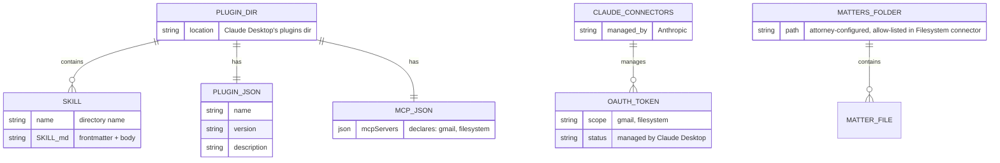

# App - Solo Attorney Claude Plugin - Technical

**Product:** Solo Attorney Claude Plugin (Claude Desktop plugin)
**Audience:** Solo attorneys using Claude Desktop
**Distribution model:** Free download (lead magnet) → consulting upsell ($3K–$6K)
**Team size assumed:** 1 developer + 1 content/legal SME
**Monthly infrastructure budget assumed:** $0 at MVP scale

---

## Architectural Context

This product is a **Claude Desktop plugin** — a small folder structure containing skill content and a manifest, packaged as a `.zip` file the attorney installs into Claude Desktop with a one-click drag-and-drop. There is no backend, no MCP server, no auth layer, and no per-user infrastructure.

(`.zip` is a ZIP archive with the `.zip` extension that Claude Desktop recognises natively. The format has two variants: **standalone** bundles a single MCP server, and **plugin** bundles skills plus declared connector requirements. We use the plugin variant.)

The architecture is deliberately minimal because **Claude Desktop already ships first-party managed connectors** for Gmail, Filesystem, Google Drive, Google Calendar, and GitHub. Our plugin declares which connectors it requires; Claude Desktop handles OAuth, token storage, refresh, and the actual API calls. We never touch attorney credentials or write any integration code.

The plugin reduces to two layers:

1. **Skill content** — five `SKILL.md` files, a master system prompt, and supporting docs. This is the entirety of what we produce.
2. **Distribution infrastructure** — a landing page, email capture form, and `.zip` hosting. All on free tiers.

Marginal cost per installed attorney is zero. Infrastructure cost is flat regardless of download volume up to ~10K email subscribers.

---

## 1. Stack Summary

| Layer | Technology | Notes |
|---|---|---|
| **Plugin Runtime** | Claude Desktop (managed by Anthropic) | We write no runtime code. |
| **Plugin Format** | Claude Plugin (`.claude-plugin/plugin.json` + `.mcp.json` + `skills/`), packaged as `.zip` (plugin variant) | Open spec at code.claude.com/docs/en/plugins. |
| **Skills** | `SKILL.md` (Anthropic spec) | YAML frontmatter + markdown body. Five files. |
| **Gmail Integration** | Claude Desktop built-in Gmail connector | Declared as required in `.mcp.json`. Anthropic handles OAuth, tokens, refresh. |
| **Filesystem Integration** | Claude Desktop built-in Filesystem connector | Declared as required in `.mcp.json`. Anthropic handles path permissions. |
| **Landing Page** | React (Next.js) on Cloudflare Pages | Static site with edge API route for Kit; free tier. |
| **Plugin Hosting** | GitHub Releases | Free unlimited bandwidth for public `.zip` release assets. |
| **Email Capture** | Kit (formerly ConvertKit) — free Newsletter plan | Up to 10,000 subscribers free. |
| **Web Analytics** | Cloudflare Web Analytics | Free, privacy-friendly. |
| **Code Hosting / CI** | GitHub + GitHub Actions | Free; CI packs the `.zip` on tag push. |

**Total monthly cost at MVP scale: $0.**

---

## 2. Key Architectural Decisions

### 2.1 Use Claude Desktop's built-in connectors; build no MCP servers

**Decision:** The plugin declares Gmail and Filesystem as required connectors in `.mcp.json` rather than bundling its own MCP servers.

**Why:** Claude Desktop ships first-party managed connectors for Gmail, Filesystem, Google Drive, Calendar, and GitHub. Declaring them as requirements via `.mcp.json` causes Claude Desktop to prompt the attorney with a "Connect" button; Anthropic handles the entire OAuth flow, secure token storage, and refresh — through their own infrastructure, with their own DPA and audited security posture.

Building our own MCP servers would require provisioning Google OAuth credentials, shipping a Node.js runtime, managing tokens in the OS keychain, and operating the security boundary for attorney email access. None of that adds value to the attorney — it just creates risk and maintenance burden we own.

**Trade-off:** We are coupled to whatever tool names and capabilities the built-in connectors expose. If Anthropic renames a Gmail tool or changes an argument schema, our skills break. Mitigation: pin the plugin to specific Claude Desktop versions in the README and monitor Anthropic's changelog.

### 2.2 Plugin variant of `.zip`, not standalone

**Decision:** Package as the **plugin variant** of `.zip`, not the standalone variant.

**Why:** The format has two variants per Anthropic's spec. The **standalone** variant bundles a single MCP server with its dependencies — appropriate when shipping a custom MCP server. The **plugin** variant bundles skills + connector requirement declarations + manifests — appropriate when reusing Anthropic's built-in connectors. Since we ship no MCP server, the plugin variant is the right choice.

**Both variants give the attorney the same one-click `.zip` install experience** in Claude Desktop. The choice is purely about what's inside the bundle.

**Alternative considered:** Standalone `.zip`. Rejected because the only reason to use it would be to bundle a runtime — and we have none.

### 2.3 Compliance language lives in skills, not in a custom UI

**Decision:** Required ethical guardrails (ABA Op. 512 / *Heppner* warnings) are enforced through the master system prompt and through mandatory headers/footers in every skill output, not through a custom first-run screen.

**Why:** Plugins do not execute code on install — they cannot show custom UI. The compliance layer must be content-driven. This is acceptable because Claude is the surface where attorneys interact with the plugin, and Claude enforces the system prompt on every conversation.

**Implementation:** Every SKILL.md body begins with a section instructing Claude to prefix and suffix every output with the required attorney-review and confidentiality language. The README's first section is a hard compliance gate the attorney must read before configuring the plugin.

---

## 3. Infrastructure

### 3.1 Hosting & Deployment

| Environment | Purpose | Host |
|---|---|---|
| **Dev** | Local plugin development and skill testing | Developer's laptop; plugin loaded into Claude Desktop via Personal Plugins panel |
| **Distribution** | Public landing page + `.zip` download | Cloudflare Pages (landing) + GitHub Releases (`.zip` artifact) |
| **CI/CD** | Validate skills, pack, and publish on git tag | GitHub Actions |

**CI flow on tag push (`v1.0.0`, etc.):**
1. Run `npm run validate` (`scripts/validate-plugin.mjs`) against `plugin.json`, `.mcp.json`, and all `SKILL.md` frontmatter
2. Run `npm run pack` to produce `solo-attorney-assistant-v1.0.0.zip`
3. Run `npm run checksum` to compute SHA-256
4. Run `npm run deploy:artifact` to copy bundle to `site/public/downloads/`
5. Publish `.zip` + checksum to GitHub Releases
6. Trigger Cloudflare Pages rebuild so the landing page links to the new version

### 3.2 "Database" Schema (local-only state)

There is no central database. State lives entirely on the attorney's machine and inside Claude Desktop:



**What this means:**
- The plugin directory lives wherever Claude Desktop stores Personal Plugins.
- OAuth tokens are managed by Claude Desktop — we have no access and do not store them.
- Matter files live wherever the attorney configured the Filesystem connector.
- No cloud-side records, ever. We do not know who has installed the plugin.

### 3.3 Background Jobs

There are no background jobs anywhere. The plugin is static content. The only periodic processes are on the distribution side:

| Job | Schedule / Trigger | Purpose |
|---|---|---|
| **CI: build & release** | On git tag push | GitHub Actions validates skills and publishes the `.zip`. |
| **Email drip sequence** | Triggered by download/opt-in | Kit sends a 4-email nurture sequence ending in a consulting CTA. |

### 3.4 Third-Party Integrations

| Service | Purpose | Tier / Cost at MVP |
|---|---|---|
| **Anthropic Claude Desktop** | The runtime — and the manager of all connector OAuth | Paid by attorney (Claude Pro / Team / Enterprise) |
| **Cloudflare Pages** | Landing page hosting | Free (unlimited bandwidth) |
| **GitHub Releases** | `.zip` artifact distribution | Free (unlimited bandwidth on public release assets) |
| **Kit (ConvertKit)** | Email capture + nurture sequence | Free Newsletter plan up to 10,000 subscribers |
| **Cloudflare Web Analytics** | Visitor analytics on landing page | Free |
| **GitHub Actions** | CI/CD pipeline | Free on public repos |

**Total third-party cost at MVP: $0/month.**

**Note: there is no Google Cloud project required.** The attorney connects their own Gmail directly through Claude Desktop's connector UI. Anthropic provides the OAuth client.

---

## 4. Authentication & Security

### 4.1 Auth approach

**We have no authentication system.** Claude Desktop's built-in connectors handle all auth between the attorney and their third-party services (Gmail, Filesystem). Anthropic operates the Google OAuth client; tokens are stored and refreshed by Claude Desktop.

The only auth-adjacent thing we ship is the connector declaration in `.mcp.json`:

```json
{
  "mcpServers": {
    "gmail": { "type": "http", "url": "" },
    "filesystem": { "type": "http", "url": "" }
  }
}
```

When the attorney installs the plugin, Claude Desktop's Connectors panel shows Gmail and Filesystem with a "Connect" button and the note "Required by: Solo Attorney Assistant." One click per connector completes setup.

### 4.2 Data handling policies

| Data class | Where it lives | Retention |
|---|---|---|
| OAuth tokens | Managed by Claude Desktop | Until attorney disconnects in Claude's UI |
| Skill files | Plugin directory inside Claude Desktop | Until attorney uninstalls the plugin |
| Email content read by skills | Transient — held only in Claude's conversation context | Subject to attorney's Claude plan retention |
| Matter files | Attorney's local filesystem | Never copied or transmitted by us |
| Landing-page email | Kit subscriber list | Until subscriber unsubscribes; deletable on request |

**Nothing the plugin processes is ever transmitted to Protomated infrastructure.**

### 4.3 Compliance considerations

- **ABA Model Rule 1.6 (Confidentiality):** The README's first section is a hard compliance gate. It explains that attorneys must be on Claude for Work / Team / Enterprise (or Claude API with a DPA) before using the plugin for client work. The master system prompt repeats this warning at every session start.
- **ABA Formal Op. 512 (July 2024):** Every skill output includes the mandatory "AI-assisted, attorney review required" header and footer. README explicitly covers client informed-consent obligations with template language for engagement-letter disclosure.
- **GDPR / CCPA:** The landing page's email capture complies with both (clear opt-in, unsubscribe link, privacy policy linked). No PII processing inside the plugin.
- **Heppner (SDNY, Feb. 2026):** README and master system prompt warn explicitly about the privilege-waiver risk of using consumer-tier Claude with client-privileged content.

### 4.4 Security measures

- **Bundle integrity:** SHA-256 checksum published alongside every `.zip` release on GitHub.
- **No custom code surface:** We ship no executables, no MCP servers, no scripts. Reviewers can audit the entire plugin by reading the markdown files and two JSON manifests.
- **No network egress from our code:** Because we have no code. All network calls (Gmail API, etc.) are made by Anthropic's connectors, not by us.
- **Confirmation gating:** All state-changing operations (sending email, writing files) are enforced in the master system prompt — Claude must obtain explicit attorney confirmation in the conversation before invoking those tools.

### 4.5 Third-party data policies

- **Google (Gmail):** OAuth tokens identify the attorney to Google through Anthropic's OAuth client. Subject to Google's standard data-processing terms.
- **Anthropic (Claude Desktop):** Processes conversation content under whatever plan the attorney is on. The compliance gate in the README ensures the attorney understands which plan they need for client work.

---

## 5. API Architecture

### 5.1 Internal API

**The plugin exposes no API.** It declares which connectors it needs (Gmail, Filesystem) and provides skill content that Claude consumes when those connectors are active.

### 5.2 Tools consumed (provided by Claude Desktop's built-in connectors)

Tool names need to be **verified against the live Claude Desktop Gmail and Filesystem connectors** before finalising the skills. Expected surface:

| Connector | Expected tools |
|---|---|
| **Gmail** | search messages, read message, read thread, send/draft message, list labels |
| **Filesystem** | list directory, read file, write file (within configured allow-list) |

Each `SKILL.md` references these tools by name. If Anthropic renames or changes a tool, the affected skill needs a one-line update.

### 5.3 Key Abstractions

There are no abstractions in code because there is no code. The "abstraction" is the SKILL.md format itself: each skill describes when to fire, what tools to call, and what output format to produce. Claude executes the abstraction.

---

## 6. Cost Projections

### 6.1 Per-unit cost breakdowns

- **Per-attorney compute cost: $0.** Plugin runs on the attorney's Claude subscription.
- **Per-attorney API cost: $0.** Gmail and Filesystem connectors are managed and paid for by Anthropic as part of Claude Desktop.
- **Per-download bandwidth cost: $0.** GitHub Releases offers unlimited bandwidth for public `.zip` release assets.
- **Per-email-subscriber cost: $0** up to 10,000 subscribers on Kit's free Newsletter plan.

### 6.2 Monthly cost projections

The relevant scaling variable is **number of downloads / email subscribers**, not active users.

| Stage | Subscribers / Downloads | Monthly Cost | Breakdown |
|---|---|---|---|
| **MVP** | 0–500 | **$0** | All free tiers — Cloudflare Pages, GitHub Releases, Kit free, Cloudflare Analytics |
| **Growth** | 500–5,000 | **$0** | Same free tiers; no upgrades needed |
| **Scale** | 5,000–10,000 | **$0–$9** | Optional paid analytics (Plausible, $9/mo); Kit still free under 10K subs |
| **Beyond 10K** | 10,000+ | **~$59/mo** | Kit Creator plan (~$59/mo at 3K–5K subs); scales with list size |

### 6.3 Unit economics

Infrastructure cost is effectively zero up to 10,000 subscribers, so **gross margin on the consulting upsell is 100% minus consultant labour**. Worked example: 1,000 downloads → 200 opt-ins → 2% lead-to-paid = 4 consulting engagements at $4,500 average = $18,000 revenue against $0 infrastructure cost.

### 6.4 Free-tier summary

**Services costing nothing at MVP and well beyond:**
- Cloudflare Pages
- GitHub Releases
- GitHub Actions (public repos)
- Cloudflare Web Analytics
- Kit Newsletter (up to 10,000 subscribers)

**When costs first kick in:** Above 10,000 email subscribers. At that point Kit Creator (~$59/mo at 3K–5K subs) becomes necessary. Realistically 12+ months out.

---

## 7. Environment Variables

The plugin itself has no environment variables. It is static content. The CI and the landing page need a small number.

### CI/CD (GitHub Actions secrets)

| Variable | Required | Notes |
|---|---|---|
| `GH_RELEASE_TOKEN` | Required | GitHub PAT with `repo` scope for publishing releases |

### Landing page (Cloudflare Pages)

| Variable | Required | Notes |
|---|---|---|
| `KIT_API_KEY` | Required | Kit API key for the email-capture form |
| `KIT_FORM_ID` | Required | Kit form ID for the lead-capture form |

No actual secrets are committed; placeholders documented in `.env.example`.

---

## 8. Development Setup

**Assumed already installed:** git, a text editor, Claude Desktop.

```bash
# 1. Clone
git clone https://github.com/protomated/solo-attorney-assistant.git
cd solo-attorney-assistant

# 2. Inspect the structure
tree -a
# .
# ├── .claude-plugin/plugin.json
# ├── .mcp.json
# ├── skills/
# │   ├── client-status-update/SKILL.md
# │   ├── demand-letter/SKILL.md
# │   ├── engagement-letter/SKILL.md
# │   ├── intake-summary/SKILL.md
# │   └── meeting-prep/SKILL.md
# ├── prompts/system-prompt.md
# ├── CONNECTORS.md
# ├── LICENSE
# └── README.md

# 3. Install the plugin into Claude Desktop for testing
# Open Claude Desktop → Customize → Personal plugins → "+"
# Point it at the cloned directory

# 4. In Claude Desktop → Connectors, click "Connect" on Gmail and Filesystem
# (One-time, per attorney; Anthropic handles the OAuth)

# 5. Verify in a new chat:
#    - /skills lists all five skills
#    - Gmail and Filesystem tools appear in the tool list
#    - Test each skill against fixture matter folders
```

**For packaging a release:**

```bash
# Validate, pack, checksum, and deploy artifact in one step
npm run build

# Or individually:
npm run validate   # validate plugin/ structure (scripts/validate-plugin.mjs)
npm run pack       # zip to solo-attorney-assistant-v1.0.0.zip
npm run checksum   # compute SHA-256

# Cut a GitHub release (runs build first, then gh release create)
npm run release
```

Attorneys install by double-clicking the `.zip` file or dragging it into Claude Desktop's Extensions panel — Claude Desktop handles the rest.

---

## 9. Third-Party Service Setup

### 9.1 Cloudflare Pages — Landing page

**Signup URL:** https://dash.cloudflare.com/sign-up

- Connect the GitHub repo containing the Next.js landing page
- Select the **Next.js** framework preset — Cloudflare automatically applies `@cloudflare/next-on-pages` during deployment
- Build command: `npm run build`; output directory: `.next`
- Add a custom domain (e.g. `legal-plugin.protomated.com`)
- Enable Cloudflare Web Analytics in the dashboard

**Tier at MVP:** Free Pages plan.

### 9.2 Kit (formerly ConvertKit) — Email capture

**Signup URL:** https://kit.com

- Sign up for the free **Newsletter plan** (10,000-subscriber limit)
- Create a form titled "Solo Attorney Plugin Download"
- Configure the success action to send an email containing the GitHub Releases download link
- Build a 4-email nurture sequence ending in a consulting CTA

**Tier at MVP:** Free Newsletter plan.

### 9.3 GitHub — Source, Releases, CI

**Signup URL:** https://github.com

- Create the `solo-attorney-assistant` repository (private during dev, public for release)
- Configure GitHub Actions secrets per Section 7
- First release published manually via UI; subsequent via CI on tag push

**Tier at MVP:** Free.

**Note: There is no Google Cloud setup required.** The attorney connects their own Gmail through Claude Desktop's connector UI. Anthropic operates the OAuth client.

---

## 10. Deployment Checklist

### 10.1 Pre-Launch

- [ ] All five `SKILL.md` files validated against Anthropic's skill spec
- [ ] Tool names in each skill verified against Claude Desktop's live Gmail and Filesystem connectors
- [ ] Master system prompt reviewed by a licensed attorney
- [ ] Compliance language (README first section + skill headers/footers) reviewed by a licensed attorney
- [ ] README and CONNECTORS.md proofread
- [ ] Loom walkthrough video (5–7 min) recorded — showing install, connector connect, and one skill end-to-end
- [ ] Plugin tested on a clean macOS Claude Desktop install
- [ ] Plugin tested on a clean Windows Claude Desktop install
- [ ] Cloudflare Pages site deployed with custom domain + SSL active
- [ ] Kit form, success page, and nurture sequence configured
- [ ] Cloudflare Web Analytics enabled
- [ ] GitHub Release v1.0.0 published with `.zip` + SHA-256 checksum

### 10.2 Launch Day

- [ ] CI on `v1.0.0` tag completes; `.zip` is in GitHub Releases
- [ ] Landing page download link points to the correct release URL
- [ ] End-to-end test: landing page → opt-in → email → download → install → connect Gmail + Filesystem → run each of the five skills
- [ ] SHA-256 checksum verified
- [ ] Post LinkedIn launch announcement (Dele) linked to landing page
- [ ] Monitor first 24h of downloads in Cloudflare Analytics and Kit dashboard
- [ ] Watch GitHub Issues for installation failures

### 10.3 Post-Launch

- [ ] Kit broadcast to existing subscribers each time a new version ships
- [ ] Quarterly review of Anthropic's plugin spec and built-in connector tool surface for breaking changes
- [ ] Quarterly review of ABA opinions and state-bar AI-ethics guidance — update compliance language if rules change
- [ ] Monthly check on Kit subscriber count vs. 10K free-tier ceiling
- [ ] Runbook for the most common failures (Gmail connector permission scope, Filesystem path setup, restart-required-after-install)
- [ ] Feedback channel (GitHub Issues + a `mailto:` in the README) triaged weekly
- [ ] Track download-to-consulting-call conversion in Kit; target ≥3%

---

## Build Effort Estimate

| Deliverable | Hours |
|---|---|
| `plugin.json` manifest | 1 |
| `.mcp.json` connector declarations | 0.5 |
| Five `SKILL.md` files (4–5h each, including tool-name verification + test cases) | 22 |
| `prompts/system-prompt.md` (master prompt + ethical guardrail enforcement) | 3 |
| `README.md` (with compliance gate first section) | 3 |
| `CONNECTORS.md` (Gmail + Filesystem connector setup) | 1 |
| Landing page (Next.js + Kit form) | 6 |
| Loom walkthrough video | 3 |
| QA on macOS + Windows | 4 |
| Legal/SME review pass | 4 |
| **Total** | **~47 hours** |

**Estimated timeline:** 2 weeks (1 developer + 1 content/legal SME working in parallel).

This is roughly half the effort of the original architecture and almost entirely content work — exactly the kind of project where the unit-economics of a free lead magnet make sense.
